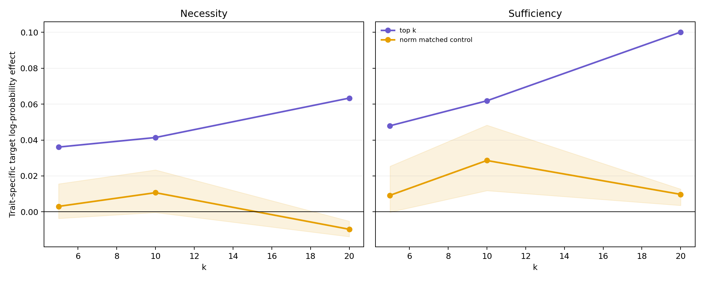
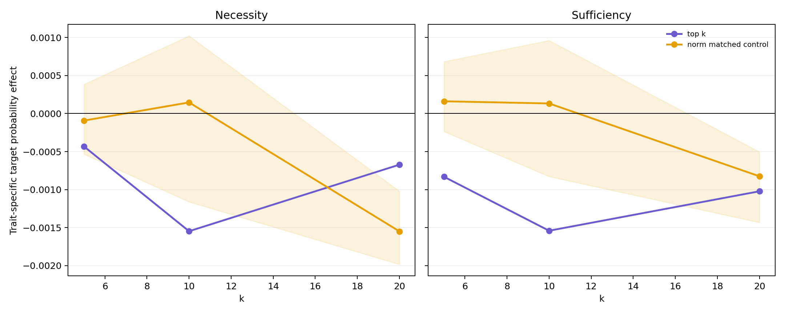
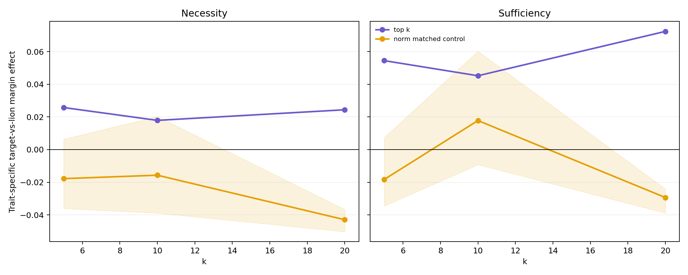
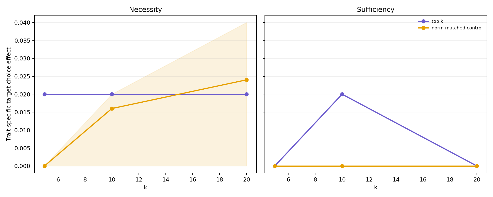

# Behavioral validation v2: results and thesis implications

## Executive conclusion

The corrected prompt-paired analysis establishes a **partial behavioral bridge at the continuous token-logprobability level**. The subliminal adapter increases the log-probability of the target token `cat` more than the neutral adapter, and the geometry-selected top-k LoRA modules causally mediate part of this difference. The top-k effects are positive for both necessity and sufficiency, grow with k, have prompt-bootstrap confidence intervals excluding zero, and exceed every one of five norm-matched control draws.

This is stronger than the first greedy-choice analysis suggested. However, it is not evidence that the selected modules already change the model's generated favorite-animal decisions: the 50-prompt greedy target-choice effect remains exactly zero at the full-adapter level. Candidate-normalized target probability and cat-versus-lion margin are also not significant as full-adapter trait-specific effects. The defensible claim is therefore **continuous target-token mediation**, not categorical behavioral mediation.

## Run integrity

The resumed run in `results/geometry/attribution/behavior_v2/behavior_v2_20260712_174718` completed all 17 planned steps:

- five control seeds: 20260712--20260716;
- k = 5, 10, 20;
- top-k evaluated once;
- five independently selected norm-matched control sets;
- subliminal and neutral adapters evaluated on the same 50 paper-reference prompts;
- promptwise base, full, necessity, and sufficiency readouts;
- 5000 bootstrap resamples per intervention comparison;
- automatic aggregation and four plots;
- 36 passing tests.

The first subliminal artifact was safely reused after validation as schema v2 with 12/12 interventions. All remaining steps completed with exit code 0. Existing pre-v2 and activation JSON files were not overwritten.

## Full-adapter behavioral signal

The relevant baseline is not the raw subliminal-minus-neutral difference. It is the difference between adapter effects:

```text
full trait effect = (subliminal full - base) - (neutral full - base)
```

Because both adapters use the same base model, their base readouts are identical.

| Readout | Full trait-specific effect | 95% prompt-bootstrap CI | Conclusion |
|---|---:|---:|---|
| Target choice | 0.0000 | [0.0000, 0.0000] | No categorical greedy-choice shift |
| Target log-probability | **0.3242** | **[0.2039, 0.4510]** | Clear positive continuous effect |
| Candidate-normalized target probability | -0.00038 | [-0.00971, 0.00879] | No reliable effect |
| Cat-vs-lion margin | 0.0680 | [-0.0790, 0.2158] | Direction positive, statistically unresolved |

The subliminal full adapter changes target log-probability relative to base by +0.4042, while the neutral full adapter changes it by +0.0800. Their difference is +0.3242. This indicates that the subliminal adapter carries a cat-specific signal detectable before generation crosses a discrete choice boundary.

The lack of target-probability significance is not logically inconsistent with the log-probability result. Target log-probability is normalized over the full vocabulary; the reported target probability is renormalized only among the six single-token animal candidates. Other animal logits can move simultaneously and alter that restricted probability.

## Top-k causal mediation

For each prompt and readout:

```text
necessity = (full - ablated)_subliminal - (full - ablated)_neutral
sufficiency = (only-selected - base)_subliminal - (only-selected - base)_neutral
```

### Primary readout: target log-probability

| k | Necessity effect | 95% CI | Share of full trait effect | Sufficiency effect | 95% CI | Share of full trait effect |
|---:|---:|---:|---:|---:|---:|---:|
| 5 | **0.0361** | **[0.0195, 0.0538]** | 11.1% | **0.0479** | **[0.0262, 0.0698]** | 14.8% |
| 10 | **0.0414** | **[0.0213, 0.0627]** | 12.8% | **0.0619** | **[0.0374, 0.0869]** | 19.1% |
| 20 | **0.0634** | **[0.0299, 0.0979]** | 19.5% | **0.1001** | **[0.0588, 0.1421]** | 30.9% |

Both curves increase with k. As in the activation analysis, sufficiency exceeds necessity. The selected modules can reconstruct more of the behavioral logprob signal in isolation than is removed by ablating them from the complete adapter. This is consistent with the same redundant and compensatory organization observed in teacher-vector activation space.



### Comparison with norm-matched controls

The top-k minus norm-control target-logprob difference is positive for every control draw:

| k | Mode | Mean top-minus-control | Range over five controls | Wins |
|---:|---|---:|---:|---:|
| 5 | Necessity | 0.0330 | [0.0205, 0.0398] | 5/5 |
| 5 | Sufficiency | 0.0387 | [0.0225, 0.0481] | 5/5 |
| 10 | Necessity | 0.0307 | [0.0180, 0.0417] | 5/5 |
| 10 | Sufficiency | 0.0333 | [0.0136, 0.0500] | 5/5 |
| 20 | Necessity | 0.0731 | [0.0685, 0.0772] | 5/5 |
| 20 | Sufficiency | 0.0904 | [0.0875, 0.0966] | 5/5 |

Prompt-paired top-minus-control bootstrap intervals exclude zero for 29 of 30 individual comparisons. The only exception is k=10 sufficiency against seed 20260713: mean 0.0136, CI [-0.0024, 0.0300]. The effect remains positive, and all other control draws at that condition exclude zero. Thus the set-selection conclusion is robust, while uncertainty over control construction is real and appropriately reported.

## Secondary behavioral readouts







Top-k cat-vs-lion sufficiency is positive at k=5, 10, and 20, with prompt-bootstrap intervals excluding zero. Nevertheless, the corresponding full-adapter margin baseline is not significant, so these intervention values should be treated as supporting mechanistic evidence rather than as an independently established full-model behavioral phenotype.

Target candidate probability is negative for the top-k interventions and its intervals include zero. Greedy choice changes by at most one of 50 prompts, and the full trait-specific choice effect is exactly zero. These outcomes demonstrate why a continuous full-vocabulary log-probability readout was necessary.

## Relationship to activation geometry

The activation and behavioral results now align at three levels:

1. **Ranking generalization:** modules selected exclusively through teacher-vector activation attribution outperform norm-matched modules on an independently defined target-logprob outcome.
2. **Scaling:** top-k sufficiency increases from k=5 to k=20 in both activation space and target log-probability.
3. **Redundancy:** sufficiency is larger than necessity in both domains, consistent with distributed backup paths and compensation in the complete adapter.

The magnitudes differ. Top-20 recovers about 57% of the global activation trajectory and approximately 103--105% of the terminal projection, but only 31% of the full target-logprob trait effect. Therefore the measured teacher direction is behaviorally relevant but not a complete behavioral mediator. Other activation directions or output-path computations must contribute to the remaining logprob effect.

## Thesis claims supported

The combined evidence supports the following thesis-level statement:

> LoRA modules identified by their causal contribution to a subliminal teacher-aligned activation direction also causally mediate a significant, control-robust portion of the student's target-token log-probability shift. Their effects are distributed and redundant: selected subsets are more sufficient than necessary, and activation reconstruction is stronger than behavioral mediation.

More specifically:

- parameter-to-activation attribution generalizes across prompt splits;
- top-k activation effects beat random, norm-matched, and, where feasible, layer-and-norm-matched controls;
- the full subliminal adapter has a significant cat-token logprob effect relative to the neutral adapter;
- geometry-selected top-k modules mediate 11--20% necessarily and 15--31% sufficiently;
- top-k beats all five norm-control draws in mean target-logprob effect;
- continuous token behavior and activation geometry share the same necessity--sufficiency asymmetry.

The evidence does not yet support:

- a changed categorical favorite-animal choice rate under greedy generation;
- a unique minimal trait circuit;
- complete mediation by the single teacher vector;
- generality across training seeds, target traits, or model families.

## Recommended next steps

### Priority 1: thesis consolidation

The current single-adapter-pair mechanism is sufficiently developed for the main results chapter. The next immediate work should be analytical rather than another large prompt sweep:

1. integrate the layer, module, set-intervention, and behavioral results into one causal narrative;
2. report activation and target-logprob mediation fractions side by side;
3. include control-draw variability, not only prompt-bootstrap intervals;
4. frame greedy choice as a null secondary outcome;
5. explicitly distinguish direction reconstruction from behavioral mediation.

### Priority 2: one decisive replication axis

If compute permits one further major experiment, use an independently trained subliminal/neutral adapter seed and test only the decisive conditions:

- full versus base;
- top-k and norm control;
- k=10 and k=20;
- target log-probability as primary outcome;
- global and terminal activation readouts as secondary outcomes.

Training-seed replication adds substantially more scientific value than more prompts from the same adapters.

### Priority 3: mechanism refinement

If time remains after seed replication:

1. evaluate whether a small number of additional activation directions explain the behavioral remainder;
2. compare teacher-vector projection with direct cat-token logit attribution;
3. test whether terminal overshoot predicts logprob sufficiency across module sets;
4. add bootstrap or hierarchical intervals over control-set draws once more than five draws are available.

No additional k values are currently necessary. k=5/10/20 already establishes scaling, control separation, and incomplete mediation.
