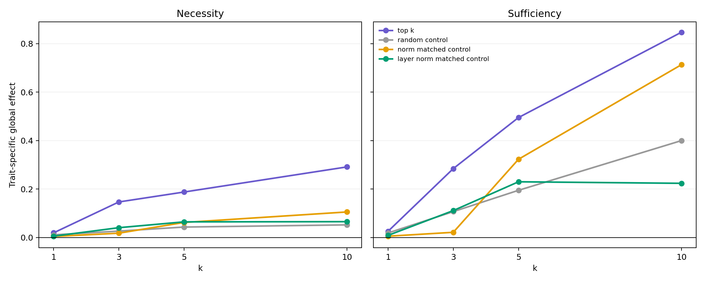
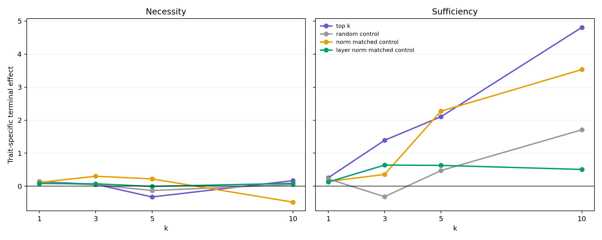
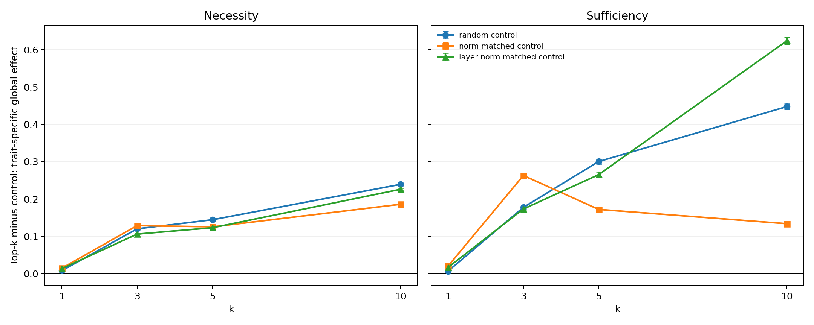
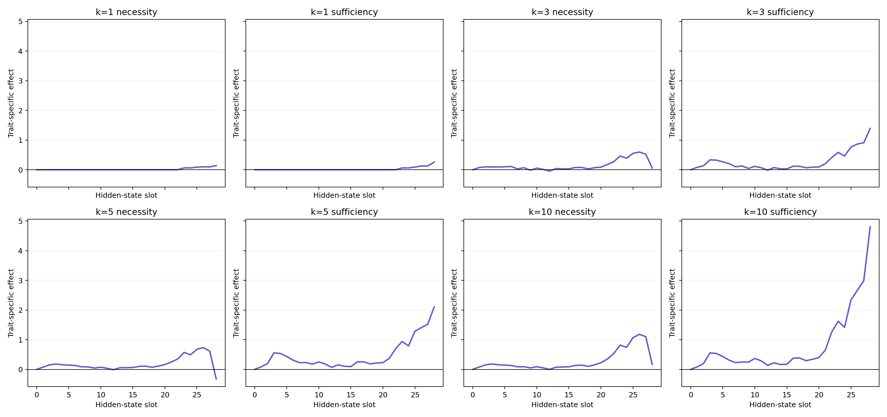

# Top-k necessity/sufficiency: results and validation plan

## Status

The first joint module-set intervention run completed successfully on 256 prompts at offset 4096. This range is disjoint from the Phase-2 module-ranking prompts at offset 2048. Both adapters used the same prompts and teacher vector. All 32 planned interventions completed, the paired comparison used 5000 prompt-bootstrap samples, and the test suite passed.

Primary artifacts:

- `results/geometry/attribution/cat_subliminal_topk_interventions_seed1.json`
- `results/geometry/attribution/cat_neutral_topk_interventions_seed1.json`
- `results/geometry/attribution/cat_paired_topk_interventions_seed1.json`
- `docs/notes/post-report/assets/topk_interventions/topk_intervention_summary.json`

## Definitions

- **Necessity:** disable the selected modules in the complete adapter. The effect is full-adapter projection minus ablated projection.
- **Sufficiency:** enable only the selected modules. The effect is reconstructed projection relative to the disabled-adapter base.
- **Trait-specific effect:** subliminal intervention effect minus neutral intervention effect, paired by prompt.
- **Global effect:** mean over hidden-state slots 1--28.
- **Terminal effect:** effect at the final transformer-block readout.

The global readout describes the complete activation trajectory. It is not interpreted alone because early modules can influence more slots than late modules. Terminal and slotwise trajectories are therefore mandatory companion readouts.

## Main results

The trait-specific full-adapter baseline is 2.8223 globally and 7.4632 terminally.

| k | Necessity global | Baseline fraction | Sufficiency global | Baseline fraction | Necessity terminal | Sufficiency terminal |
|---:|---:|---:|---:|---:|---:|---:|
| 1 | 0.0192 | 0.7% | 0.0257 | 0.9% | 0.1358 | 0.2566 |
| 3 | 0.1467 | 5.2% | 0.2844 | 10.1% | 0.0576 | 1.3902 |
| 5 | 0.1877 | 6.7% | 0.4952 | 17.5% | -0.3241 | 2.1027 |
| 10 | 0.2915 | 10.3% | 0.8476 | 30.0% | 0.1698 | 4.8064 |

## Interpretation

The ranked top-k sets outperform random, norm-matched, and layer-and-norm-matched controls in global necessity for every tested k. Every prompt-bootstrap interval for the top-minus-control global contrast is above zero. The Phase-2 individual-module ranking therefore contains joint causal information that is not explained solely by LoRA update norm or layer membership.

The central mechanistic result is the asymmetry between sufficiency and necessity. Top-10 reconstructs 30.0% of the global trajectory and 64.4% of the terminal signal, but removing those modules eliminates only 10.3% globally and 2.3% terminally. A small set can generate a substantial part of the trait direction, while the remaining adapter compensates when that set is removed. This supports a **compressible but redundant implementation**, rather than a single localized trait circuit.

The negative terminal necessity value at k=5 and the non-monotonic terminal curve are treated as compensation or interaction evidence, not as module irrelevance. Sufficiency and necessity answer different causal questions and must not be collapsed into one score.

## Current uncertainty and required validation

The existing confidence intervals quantify prompt uncertainty only. Each control type currently has one selected module set. They do not quantify uncertainty over control-set construction. Furthermore, k=10 has not established where global or terminal recovery saturates, and activation geometry has not yet been connected directly to observable animal preference under the same module interventions.

`run_topk_validation_and_behavior.ps1` addresses these limitations without reusing ranking prompts:

1. evaluate offsets 4096 and 4352 as separate 256-prompt validation splits;
2. extend nested sets to k = 1, 3, 5, 10, 15, 20;
3. use five control seeds;
4. sample global norm controls reproducibly from the three closest eligible candidates;
5. avoid recomputing identical top-k sets for later control seeds;
6. aggregate variability across prompt splits and control draws;
7. evaluate greedy behavior on the 50 distinct paper-reference prompts for top-k and norm-matched controls at k = 5, 10, 20;
8. run the complete test suite at the end.

Strict disjoint layer-and-norm matching remains part of the existing and extended k<=10 evidence. It is impossible at k=15/20 because top-15 contains five of the seven analyzed Layer-0 modules and top-20 contains six. The extended saturation runs therefore use random and global norm-matched controls; they never introduce an overlapping pseudo-control.

The behavioral analysis is confirmatory but still preliminary: choice rates have discrete sampling uncertainty, and one adapter-training seed cannot establish training-seed generality. A later thesis-level replication should add independently trained subliminal and neutral adapter seeds if compute permits.

## Decision rule after the unattended run

Proceed to the final thesis analysis if all of the following hold:

- top-k necessity remains above the distribution of matched controls across both prompt splits;
- the sufficiency curve is monotonic or its non-monotonicity is reproducible and mechanistically interpretable;
- terminal recovery shows a stable saturation pattern by k=15 or k=20;
- behavioral top-k effects exceed matched controls in the same direction as activation effects.

If activation effects replicate but behavioral effects do not, the defensible conclusion is narrower: the modules causally reconstruct the teacher-vector geometry, but that geometry is not by itself established as the behavioral mediator.
