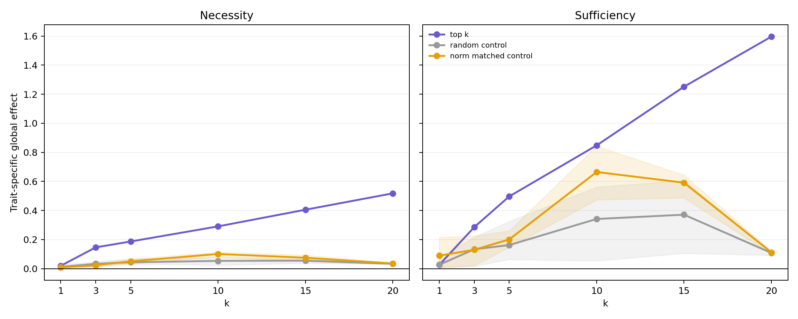
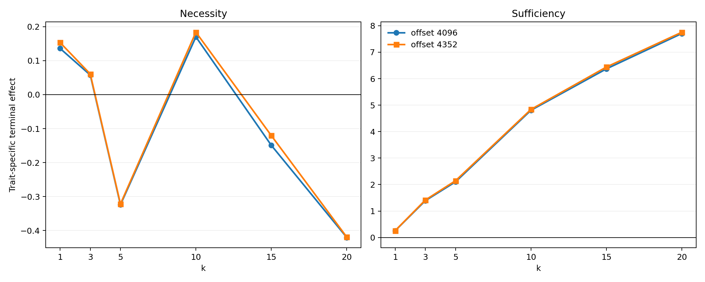
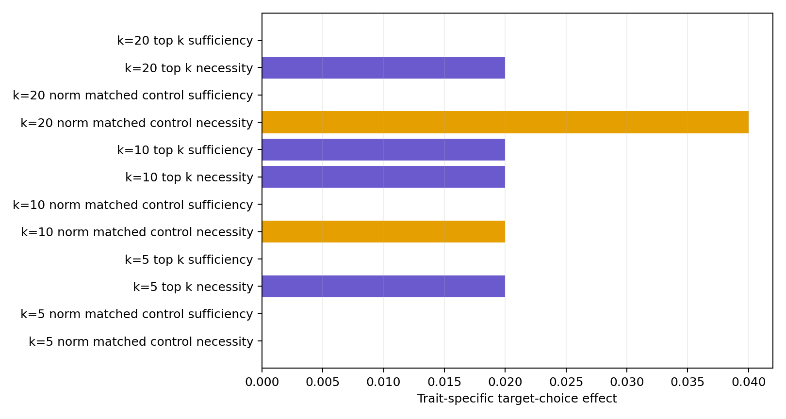

# Top-k validation: thesis conclusions after replicated interventions

## Executive conclusion

The confirmatory activation experiments strongly replicate the Phase-2 module ranking. From k=3 onward, the ranked module sets outperform every random and norm-matched control draw on both disjoint prompt splits. The top modules are therefore not merely correlational markers or large LoRA updates: they are causally enriched for reconstructing the teacher-vector activation geometry.

The results do **not** support a small set of uniquely necessary trait modules. Instead, they support a **compressible but redundantly implemented mechanism**. Top-k-only reconstruction recovers a large and monotonic share of the trait-specific signal, while ablating the same modules removes much less and can even increase the terminal projection. This necessity--sufficiency asymmetry is the central mechanistic result.

The behavioral stage does not currently establish that this activation geometry mediates observable cat preference. Subliminal and neutral adapters produced identical base and full-adapter choice rates, and the intervention differences were only zero, two, or four percentage points. The activation claim is strong; the activation-to-behavior mediation claim remains unproven.

## Experimental integrity

The unattended run completed all steps between 14:37 and 17:18 on 12 July 2026:

- 256 prompts at offset 4096;
- a second disjoint set of 256 prompts at offset 4352;
- k = 1, 3, 5, 10, 15, 20;
- five control seeds per split;
- paired subliminal-minus-neutral evaluation;
- random and globally norm-matched controls;
- 5000 prompt-bootstrap samples in each paired comparison;
- behavioral top-k and norm-control interventions;
- 36 passing tests.

The two activation splits are disjoint from each other and from the Phase-2 ranking prompts beginning at offset 2048. The complete run status is stored in `results/geometry/attribution/logs/topk_validation_20260712_143725/run_status.json`.

Strict layer-and-norm matching is available in the earlier k<=10 experiment. It is mathematically impossible for k=15/20 because top-15 contains five of seven analyzed Layer-0 modules and top-20 contains six. The extended validation correctly uses disjoint random and global norm controls rather than an overlapping pseudo-control.

## Replication across prompt splits

The trait-specific full-adapter baselines are nearly identical:

| Prompt offset | Global baseline | Terminal baseline |
|---:|---:|---:|
| 4096 | 2.8223 | 7.4632 |
| 4352 | 2.8046 | 7.3872 |

Across all top-k conditions, the absolute split difference is at most 0.00331 globally. Terminal differences are also small relative to their scale, at most 0.0696. Signs, curve shapes, the necessity--sufficiency gap, and the k ordering reproduce.

This stability is strong enough to treat prompt sampling as a minor source of uncertainty for the present adapter pair. It does not replace replication across independently trained adapter seeds.

## Top-k recovery and removal

The following table uses the mean over both validation splits. Fractions use the corresponding full-adapter baseline and are rounded because the two baselines differ slightly.

| k | Global necessity | Global removed | Global sufficiency | Global recovered | Terminal necessity | Terminal sufficiency |
|---:|---:|---:|---:|---:|---:|---:|
| 1 | 0.0199 | 0.7% | 0.0260 | 0.9% | 0.1445 | 0.2586 |
| 3 | 0.1464 | 5.2% | 0.2857 | 10.2% | 0.0591 | 1.4031 |
| 5 | 0.1869 | 6.6% | 0.4968 | 17.7% | -0.3229 | 2.1239 |
| 10 | 0.2908 | 10.3% | 0.8478 | 30.1% | 0.1767 | 4.8226 |
| 15 | 0.4054 | 14.4% | 1.2515 | 44.5% | -0.1349 | 6.4058 |
| 20 | 0.5181 | 18.4% | 1.5961 | 56.7% | -0.4197 | 7.7314 |

Top-20-only reconstructs approximately 57% of the global activation trajectory. At the terminal readout it reaches 103--105% of the full-adapter baseline on the two splits. This is a small but reproducible overshoot, not exact recovery. It implies that modules outside top-20 partly suppress, rotate, or normalize the final projection when the full adapter is active.

Conversely, ablating top-20 removes only about 18% globally. Its terminal necessity is negative on both splits: removing top-20 increases the terminal projection relative to the full adapter. This cannot be reconciled with an additive localized circuit. It is evidence of downstream compensation and antagonistic interactions among LoRA modules.

The terminal necessity curve is intentionally not monotonic. The terminal sufficiency curve is monotonic and extremely stable. Thus the selected modules increasingly possess the capacity to generate the direction, while their indispensability inside the complete adapter remains low and context-dependent.

## Robustness against control selection

Each control type has ten observations: five module-set draws on each of two prompt splits. The table reports top-k minus control for the global readout, pooled over these ten matched comparisons.

| k | Mode | vs. random: mean [range] | Wins | vs. norm-matched: mean [range] | Wins |
|---:|---|---:|---:|---:|---:|
| 1 | Necessity | 0.0072 [-0.0085, 0.0142] | 8/10 | 0.0112 [0.0036, 0.0164] | 10/10 |
| 1 | Sufficiency | -0.0011 [-0.0503, 0.0160] | 8/10 | -0.0634 [-0.1900, 0.0210] | 6/10 |
| 3 | Necessity | 0.1130 [0.0988, 0.1342] | 10/10 | 0.1232 [0.1110, 0.1314] | 10/10 |
| 3 | Sufficiency | 0.1525 [0.0685, 0.2705] | 10/10 | 0.1558 [0.0598, 0.2663] | 10/10 |
| 5 | Necessity | 0.1430 [0.1177, 0.1539] | 10/10 | 0.1364 [0.1218, 0.1534] | 10/10 |
| 5 | Sufficiency | 0.3345 [0.1732, 0.4344] | 10/10 | 0.2959 [0.2349, 0.3509] | 10/10 |
| 10 | Necessity | 0.2372 [0.2137, 0.2675] | 10/10 | 0.1899 [0.1761, 0.2094] | 10/10 |
| 10 | Sufficiency | 0.5061 [0.2865, 0.7947] | 10/10 | 0.1830 [0.0052, 0.3744] | 10/10 |
| 15 | Necessity | 0.3505 [0.3381, 0.3684] | 10/10 | 0.3303 [0.3110, 0.3569] | 10/10 |
| 15 | Sufficiency | 0.8803 [0.6451, 1.1462] | 10/10 | 0.6603 [0.6068, 0.7651] | 10/10 |
| 20 | Necessity | 0.4846 [0.4797, 0.4889] | 10/10 | 0.4823 [0.4777, 0.4882] | 10/10 |
| 20 | Sufficiency | 1.4879 [1.4783, 1.5041] | 10/10 | 1.4842 [1.4759, 1.4965] | 10/10 |

k=1 is not specifically sufficient: some single norm-matched modules are stronger. From k=3 onward, top-k wins every comparison for both causal modes. The ranking therefore becomes reliable as a distributed set ranking rather than as a claim that the single highest-ranked module is uniquely privileged.

The large control variability at intermediate k is scientifically relevant. Module norm and generic adapter capacity explain part of sufficiency, especially around k=10. The top-k advantage nevertheless survives every draw. At k=20 the control effects collapse while top-k continues to grow, producing a particularly strong separation.

## Behavioral result

Both adapter evaluations had the same rates on the 50 paper-reference prompts:

| Condition | Base target-choice rate | Full-adapter target-choice rate | Full-adapter shift |
|---|---:|---:|---:|
| Subliminal adapter run | 0.08 | 0.04 | -0.04 |
| Neutral adapter run | 0.08 | 0.04 | -0.04 |

Thus the tested subliminal adapter does not show a cat-specific generative choice advantage over the neutral adapter under this greedy evaluation. Intervention-level trait-specific choice effects are restricted to 0.00, 0.02, or 0.04 and matched controls can be equally large.

This is a null or inconclusive behavioral result, not evidence of mediation. The two-percentage-point resolution is a consequence of 50 deterministic choices. Moreover, the behavioral artifact stores continuous token metrics for each intervention but not the base and full-adapter token-metric baselines. Therefore necessity and sufficiency cannot yet be converted into the same properly baseline-adjusted, paired token-logit contrasts used for activation geometry.

Some intervention contexts show positive subliminal-minus-neutral target-logprob differences, but these cannot be attributed to the module intervention without subtracting the corresponding full or base difference. They must not be reported as a successful behavioral effect.

## Thesis-level claims supported now

The present evidence supports the following claims:

1. Parameter-level LoRA module ranking predicts causal activation effects on unseen prompts.
2. The signal is distributed across mechanistically diverse layers and modules.
3. The ranked subset is strongly sufficient relative to matched controls from k=3 onward.
4. The same subset is only weakly necessary inside the full adapter.
5. Terminal overshoot and negative terminal necessity demonstrate non-additivity, compensation, and antagonistic module interactions.
6. Prompt-split stability is excellent for this adapter pair.

The present evidence does **not** support:

1. that the selected modules are a unique minimal circuit;
2. that teacher-vector projection is already proven to mediate cat-choice behavior;
3. generality across training seeds, traits, model families, or full fine-tuning.

## Recommended next step

The activation analysis is mature enough for the main thesis results chapter. More prompt-only activation runs have low marginal value. The next experiment should repair and strengthen the behavioral bridge:

1. store promptwise base, full, necessity, and sufficiency candidate logits/probabilities;
2. define paired token-level causal effects exactly analogously to activation effects;
3. use target logprob and target-versus-competitor margin as primary continuous outcomes;
4. bootstrap prompts and compare top-k against multiple matched control draws;
5. retain generated choice rate as a secondary, low-power outcome;
6. if compute permits, replicate the decisive k=5/10/20 conditions with independently trained adapter seeds.

If the corrected continuous behavioral analysis remains null, the thesis should state that parameter interventions causally reconstruct a teacher-aligned activation direction without demonstrating behavioral mediation. That is a valid and informative boundary result rather than a failed activation study.

