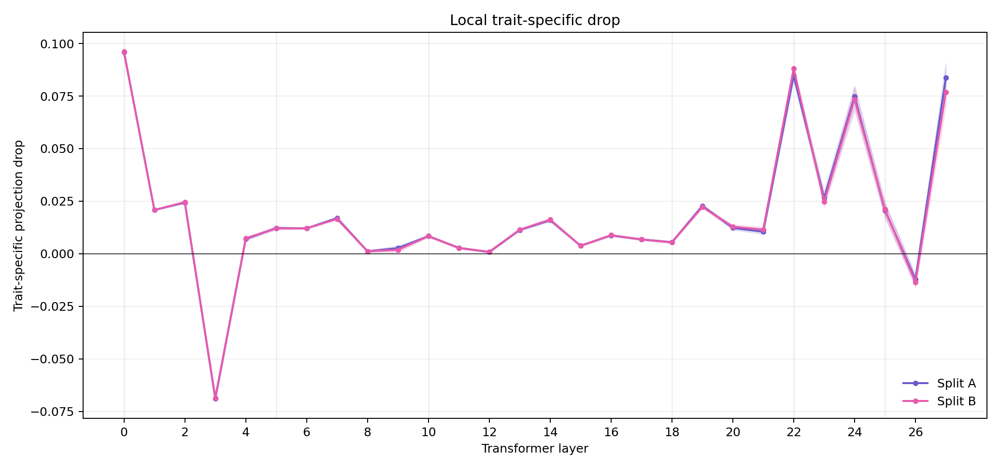
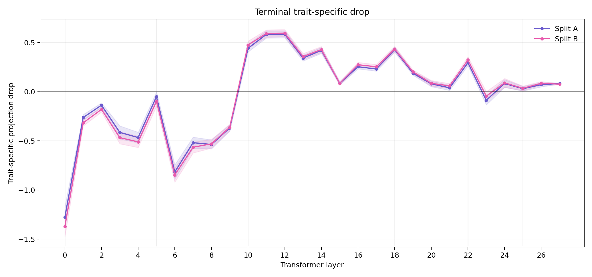
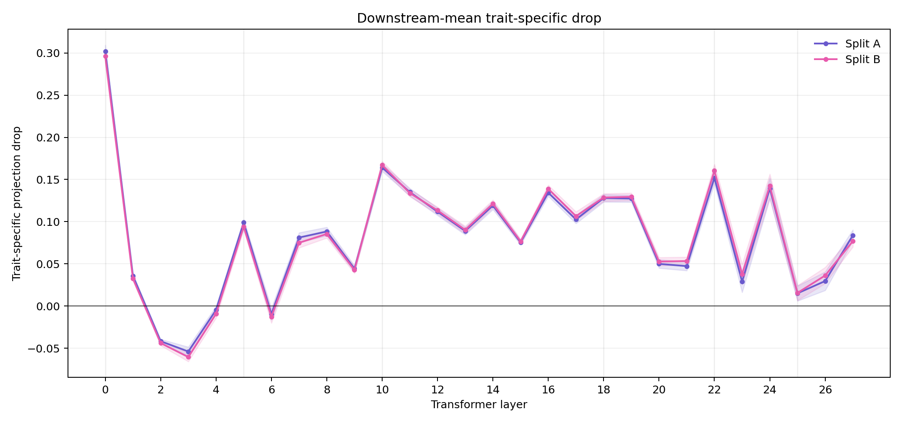
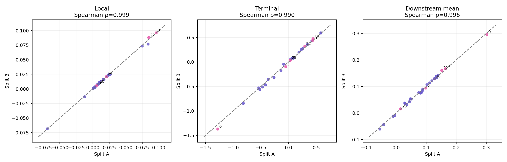

# Schema-v2 layer attribution: split stability and Phase-2 selection

Date: 2026-07-12

## Executive conclusion

The schema-v2 layer screen is stable enough to proceed to Phase 2. Across two disjoint 128-prompt splits, the primary downstream-mean ranking has Spearman correlation `0.9956`, Kendall's tau `0.9630`, identical top 3, 4/5 top-5 overlap, 6/7 top-7 overlap, and stable signs for all 28 layers.

The Phase-2 layer set is:

> **0, 5, 10, 18, 22, 25**

It was selected for mechanistic diversity rather than simply taking the six largest downstream scores:

- layer 0: early local installation with strong downstream influence and negative terminal compensation;
- layer 5: early propagation with modest local effect and near-zero/slightly negative terminal effect;
- layer 10: boundary layer with small local but strong terminal/downstream influence;
- layer 18: late, terminal-dominant influence with little local effect;
- layer 22: late, locally strong and terminally persistent influence;
- layer 25: depth-matched low-effect control.

## Experimental design

Both splits use the same Qwen2.5-7B base model, frozen cat teacher vector, LoRA module groups, and evaluation procedure. They differ only in their disjoint prompt ranges:

- Split A: 128 prompts at offset 1024;
- Split B: 128 prompts at offset 1152.

For every prompt, intervention, and hidden-state slot, only the scalar projection onto the normalized teacher direction is stored. Full hidden states are not retained.

For layer `l`, the trait-specific drop is calculated promptwise as:

`drop_subliminal(l, slot) - drop_neutral(l, slot)`.

Four readouts are derived:

- **local:** slot `l + 1`, immediately after the ablated transformer block;
- **fixed target:** block 10 / slot 11, only for layers 0--10;
- **terminal:** the final transformer block;
- **downstream mean:** mean across all slots from `l + 1` onward.

The primary global score is the downstream-mean trait-specific drop. Local and terminal scores are retained to distinguish mechanistically different profiles that can have similar global scores.

Uncertainty intervals are non-parametric 95% prompt-bootstrap intervals with 5,000 resamples per layer and split. These intervals quantify prompt uncertainty, not training-seed, trait, or model-family uncertainty.

## Reproducible figures

### Local trait-specific drop



### Terminal trait-specific drop



### Downstream-mean trait-specific drop



### Split A versus Split B



The figures and their machine-readable values are regenerated with `scripts/plot_layer_split_stability.py`. The plotted values and intervals are also stored in `assets/schema_v2_layer_screening/split_stability_summary.json`.

## Split-stability statistics

| Readout | Spearman rho | Kendall tau | Mean absolute split difference | Maximum difference | Sign stability |
|---|---:|---:|---:|---:|---:|
| Local | 0.9989 | 0.9894 | 0.00073 | 0.00688 | 28/28 |
| Fixed target | 1.0000 | 1.0000 | 0.00080 | 0.00164 | 11/11 |
| Terminal | 0.9901 | 0.9524 | 0.02495 | 0.09373 | 28/28 |
| Downstream mean | 0.9956 | 0.9630 | 0.00378 | 0.00879 | 28/28 |

| Readout | Top-3 overlap | Top-5 overlap | Top-7 overlap |
|---|---:|---:|---:|
| Local | 3/3 | 5/5 | 7/7 |
| Fixed target | 3/3 | 5/5 | 7/7 |
| Terminal | 3/3 | 5/5 | 7/7 |
| Downstream mean | 3/3 | 4/5 | 6/7 |

The larger absolute differences for the terminal readout reflect its larger numerical scale. Its rank order and signs remain stable.

## Stable candidate profiles

Values are `Split A / Split B`.

| Layer | Local | Terminal | Downstream mean | Mechanistic profile |
|---:|---:|---:|---:|---|
| 0 | 0.0960 / 0.0961 | -1.2773 / -1.3710 | 0.3021 / 0.2962 | Early installation followed by terminal compensation |
| 5 | 0.0122 / 0.0121 | -0.0498 / -0.0977 | 0.0989 / 0.0940 | Early propagated influence with weak terminal persistence |
| 10 | 0.0084 / 0.0084 | 0.4422 / 0.4762 | 0.1642 / 0.1670 | Boundary amplification |
| 11 | 0.0028 / 0.0027 | 0.5832 / 0.5923 | 0.1350 / 0.1339 | Post-boundary transformation |
| 16 | 0.0087 / 0.0088 | 0.2538 / 0.2744 | 0.1343 / 0.1389 | Distributed downstream amplification |
| 18 | 0.0055 / 0.0054 | 0.4281 / 0.4343 | 0.1279 / 0.1287 | Terminal-dominant late influence |
| 22 | 0.0847 / 0.0881 | 0.2940 / 0.3231 | 0.1518 / 0.1605 | Strong late local implementation that persists |
| 24 | 0.0749 / 0.0735 | 0.0835 / 0.0899 | 0.1393 / 0.1424 | Strong local, weak terminal persistence |
| 25 | 0.0206 / 0.0210 | 0.0306 / 0.0345 | 0.0150 / 0.0156 | Depth-matched low-effect control |

Layers 10--12 demonstrate why local attribution alone is insufficient: their local effects are small, while their terminal and downstream effects are large. Layer 24 shows the converse pattern. Early layers 0, 6, 7, and 8 can have positive fixed-target effects but negative terminal effects, demonstrating substantial downstream compensation.

## Bootstrap intervals for the selected layers

The intervals below are for the primary downstream-mean score.

| Layer | Split A mean [95% CI] | Split B mean [95% CI] |
|---:|---:|---:|
| 0 | 0.3021 [0.2948, 0.3094] | 0.2962 [0.2880, 0.3043] |
| 5 | 0.0989 [0.0949, 0.1028] | 0.0940 [0.0897, 0.0980] |
| 10 | 0.1642 [0.1598, 0.1688] | 0.1670 [0.1625, 0.1717] |
| 18 | 0.1279 [0.1235, 0.1325] | 0.1287 [0.1239, 0.1333] |
| 22 | 0.1518 [0.1451, 0.1590] | 0.1605 [0.1527, 0.1682] |
| 25 | 0.0150 [0.0058, 0.0241] | 0.0156 [0.0067, 0.0245] |

Layer 25 is a low-effect rather than a strict null control: its interval is slightly above zero. It is nevertheless preferable to an early near-zero layer because it controls for depth in comparisons with layers 18 and 22.

## Selection rationale and rejected alternatives

- **Layer 11** is highly stable and has the largest terminal effect, but overlaps scientifically with the boundary/terminal mechanisms covered by layers 10 and 18. It is the first expansion candidate if compute permits.
- **Layer 16** is stable but its profile is less extreme than layer 18's terminal-dominant profile.
- **Layer 24** is highly informative, but its strong-local/weak-terminal profile partly overlaps with layer 22. It is the second expansion candidate.
- **Layer 6** has one of the strongest fixed-target effects but a negative global downstream score. It is useful for studying compensation, not for the primary module screen.
- **Layer 4** is close to zero globally, but is not depth-matched to the late candidates and has a clear fixed-target effect.

## Phase-2 command

The preregistered full layer list is:

```text
--include-layers 0 5 10 18 22 25
```

The minimal compute-saving list is:

```text
--include-layers 0 10 18 22 25
```

Phase 2 uses prompts beginning at offset 2048, disjoint from vector extraction and both layer-screening splits. The module-level findings remain conditional on training seed 1; final mechanistic claims should replicate the strongest effects across additional training seeds.

## Phase-2 individual-module results

The full six-layer set was evaluated on 256 prompts beginning at offset 2048. Subliminal and neutral runs have identical teacher and prompt hashes, 42 identical module definitions, and complete `256 x 29` prompt-projection arrays for every module.

The primary module score is the paired trait-specific downstream-mean drop. The leading modules are:

| Rank | Module | Downstream score | Local score | Terminal score | Downstream 95% CI |
|---:|---|---:|---:|---:|---:|
| 1 | L22 `gate_proj` | 0.09360 | 0.06368 | 0.14410 | [0.08958, 0.09762] |
| 2 | L10 `up_proj` | 0.08379 | -0.00184 | 0.22686 | [0.08218, 0.08554] |
| 3 | L0 `v_proj` | 0.07158 | 0.07124 | -0.29256 | [0.06999, 0.07316] |
| 4 | L0 `o_proj` | 0.04623 | 0.00525 | -0.33034 | [0.04499, 0.04744] |
| 5 | L25 `gate_proj` | 0.04280 | 0.00375 | 0.12349 | [0.03847, 0.04728] |
| 6 | L10 `gate_proj` | 0.04091 | -0.00022 | 0.07363 | [0.03951, 0.04226] |
| 7 | L5 `down_proj` | 0.03893 | -0.00052 | 0.04517 | [0.03804, 0.03981] |
| 8 | L18 `up_proj` | 0.03747 | -0.00047 | 0.16142 | [0.03599, 0.03895] |
| 9 | L18 `v_proj` | 0.03547 | -0.00006 | 0.11600 | [0.03440, 0.03654] |
| 10 | L18 `gate_proj` | 0.03027 | 0.00166 | 0.11190 | [0.02923, 0.03137] |

The results recover the layer-level mechanistic profiles at module resolution:

- L22 is dominated by `gate_proj`, which has both a strong local and persistent terminal effect.
- L10 is dominated by `up_proj`; its local score is essentially zero while its terminal score is the largest among the leading modules.
- L0 is dominated by attention `v_proj` and `o_proj`, with positive downstream but negative terminal effects.
- L5 is led by `down_proj`, consistent with a propagated rather than locally installed effect.
- L18 distributes its terminal-dominant influence across `up_proj`, `v_proj`, and `gate_proj`.
- L25 contains strong cancellation: `gate_proj` is positively influential, while `q_proj`, `k_proj`, and `o_proj` are negative. This explains why the complete layer appears weak despite containing a strong individual contributor.

Module effects are not assumed additive. Sums of individual ablation scores are descriptive only; joint top-k necessity and sufficiency interventions are required to measure interactions and recovered effect directly.

Phase-2 artifacts:

- `results/geometry/attribution/cat_subliminal_module_screen_seed1_phase2.json`;
- `results/geometry/attribution/cat_neutral_module_screen_seed1_phase2.json`;
- `results/geometry/attribution/cat_paired_module_ranking_seed1_phase2.json`;
- `results/geometry/attribution/cat_topk_module_sets_seed1_phase2.json`.

## Prepared top-k intervention plan

Nested top-k sets use `k = 1, 3, 5, 10`. Every k has three controls:

- deterministic random control from the analyzed 42-module pool;
- globally norm-matched control;
- layer- and norm-matched control.

The top-10 set spans all mechanistic regions selected for Phase 2: two modules from L0, one from L5, two from L10, three from L18, one from L22, and one from L25.

`scripts/run_lora_set_interventions.py` implements:

- **necessity:** disable the selected modules in the full adapter;
- **sufficiency:** disable every LoRA module except the selected set;
- the same interventions for all matched control sets;
- promptwise global-downstream and terminal effects for later paired Subliminal-minus-Neutral analysis.

These interventions should use a new prompt range, defaulting to offset 4096, so selection and intervention evaluation remain disjoint.
